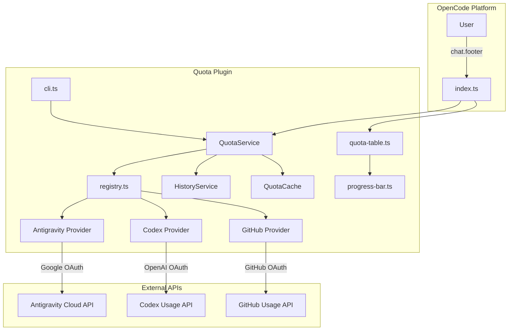

# Design & Requirements: OpenCode Quotas Plugin

This document outlines the requirements and architectural design for the `opencode-quotas` plugin.

## 1. Requirements

### Functional Requirements

| Requirement | Description |
|-------------|-------------|
| **Aggregate Quotas** | Retrieve quota data from multiple independent providers (Antigravity, Codex, etc.) |
| **Message Footer Injection** | Automatically render quotas in the chat footer after each final assistant response |
| **Visual Representation** | Display percentage-based quotas using ASCII progress bars with ANSI color gradients |
| **Dynamic Grouping** | Allow user-defined grouping of granular metrics into categories |
| **Predictive Aggregation** | Group related quotas and predict which one will hit its limit first using linear regression |
| **Usage History** | Persist usage snapshots locally to enable trend analysis and forecasting |
| **Configurable Views** | Customize column layout and visibility |

### Non-Functional Requirements

| Requirement | Description |
|-------------|-------------|
| **Resilience** | Failure of one provider must not crash the plugin |
| **Extensibility** | Registry Pattern for easy addition of new providers |
| **Performance** | Parallel fetching using `Promise.all` |
| **Zero Configuration** | Use existing system credentials where possible |

---

## 2. Architecture

### Component Diagram



### Data Flow

1. **Initialization**: `QuotaService.init()` loads config and registers providers
2. **Caching**: `QuotaCache` polls providers at configurable intervals
3. **History**: `HistoryService` persists usage snapshots for prediction
4. **Processing**: `QuotaService.processQuotas()` enriches, aggregates, filters, and sorts
5. **Rendering**: `renderQuotaTable()` produces formatted output

---

## 3. Core Components

### QuotaData Interface

The common data model for all quota entries:

```typescript
interface QuotaData {
  id: string;           // Unique identifier (e.g., "codex-primary")
  providerName: string; // Display name
  used: number;         // Current consumption
  limit: number | null; // Total allowed (null = unlimited)
  unit: string;         // e.g., "%", "credits"
  
  // Structured metadata
  reset?: string;           // e.g., "resets in 2h"
  predictedReset?: string;  // e.g., "in 12m (predicted)"
  window?: string;          // e.g., "5h window"
  info?: string;            // e.g., "!!", "unlimited"
}
```

### Provider Registry

Singleton pattern for managing quota providers:

```typescript
interface IQuotaProvider {
  id: string;
  fetchQuota(): Promise<QuotaData[]>;
}

interface IQuotaRegistry {
  register(provider: IQuotaProvider): void;
  getAll(): IQuotaProvider[];
}
```

### QuotaService

Centralized service for:
- Configuration management
- Provider coordination
- Quota processing (enrichment, aggregation, filtering, sorting)
- Prediction calculations

### QuotaCache

Background caching layer:
- Polls providers at configurable intervals
- Stores snapshots for immediate access
- Feeds history service for predictions

---

## 4. Smart Aggregation & Prediction

### Aggregation Strategies

| Strategy | Description |
|----------|-------------|
| `most_critical` | Uses linear regression to predict which quota reaches limit first |
| `max` | Displays the quota with the highest usage percentage |
| `min` | Displays the quota with the lowest usage percentage |
| `mean` | Displays a synthetic average of all quotas |
| `median` | Displays the median usage percentage |

### Predictive Modeling

The prediction system uses a **Dual-Window** linear regression approach:

1. **Long Slope**: Calculated over the full history window (default: 60 min)
2. **Short Slope**: Calculated over recent data (default: 5 min or 15% of points)
3. **Conservative Estimation**: Uses `max(longSlope, shortSlope)` to capture spikes
4. **Idle Detection**: If last usage is >5 minutes old, assumes usage stopped

**Formula**: `TimeToLimit = (Limit - CurrentUsage) / Slope`

---

## 5. UI Rendering

### Progress Bar Colors

| Usage | Color |
|-------|-------|
| < 50% | Green |
| 50-80% | Yellow |
| > 80% | Red |

### Status Indicators

| Status | Meaning |
|--------|---------|
| `OK` | Usage below warning threshold |
| `WRN` | Usage approaching limit |
| `ERR` | Usage at or exceeding limit |

### Configurable Columns

Available columns: `status`, `name`, `bar`, `percent`, `value`, `reset`, `window`, `info`, `ettl`

---

## 6. Concurrency & Safety

### Message Processing

The plugin uses multiple safeguards to prevent duplicate footer injection:

1. **PluginState**: Tracks processed message IDs
2. **Lock Acquisition**: Serializes processing per message
3. **Text Check**: Verifies footer signature before injection

### Provider Isolation

Each provider failure is caught and logged without affecting others:

```typescript
const results = await Promise.all(
  providers.map(async (p) => {
    try {
      return await p.fetchQuota();
    } catch (e) {
      console.error(`Provider ${p.id} failed:`, e);
      return [];
    }
  })
);
```

---

## 7. Configuration Schema

See `schemas/quotas.schema.json` for the full JSON Schema.

Key configuration options:

| Option | Type | Default | Description |
|--------|------|---------|-------------|
| `displayMode` | enum | `"simple"` | Display mode |
| `footer` | boolean | `true` | Enable footer injection |
| `debug` | boolean | `false` | Enable debug logging |
| `progressBar.color` | boolean | `true` | Enable ANSI colors |
| `table.columns` | array | auto | Columns to display |
| `disabled` | array | `[]` | Quota IDs to hide |
| `groups` | object | preset | Provider groupings |
| `aggregatedGroups` | array | preset | Smart aggregation config |
| `historyMaxAgeHours` | number | `24` | History retention |
| `pollingInterval` | number | `60000` | Cache refresh interval |

---

## 8. Adding a New Provider

1. Create file: `src/providers/<name>.ts`
2. Implement factory function:

```typescript
import { type IQuotaProvider, type QuotaData } from "../interfaces";

export function createMyProvider(): IQuotaProvider {
  return {
    id: "my-provider",
    async fetchQuota(): Promise<QuotaData[]> {
      // Fetch and transform quota data
      return [];
    },
  };
}
```

3. Register in `src/services/quota-service.ts`:

```typescript
registry.register(createMyProvider());
```

---

_Last Updated: 2026-01-13_
