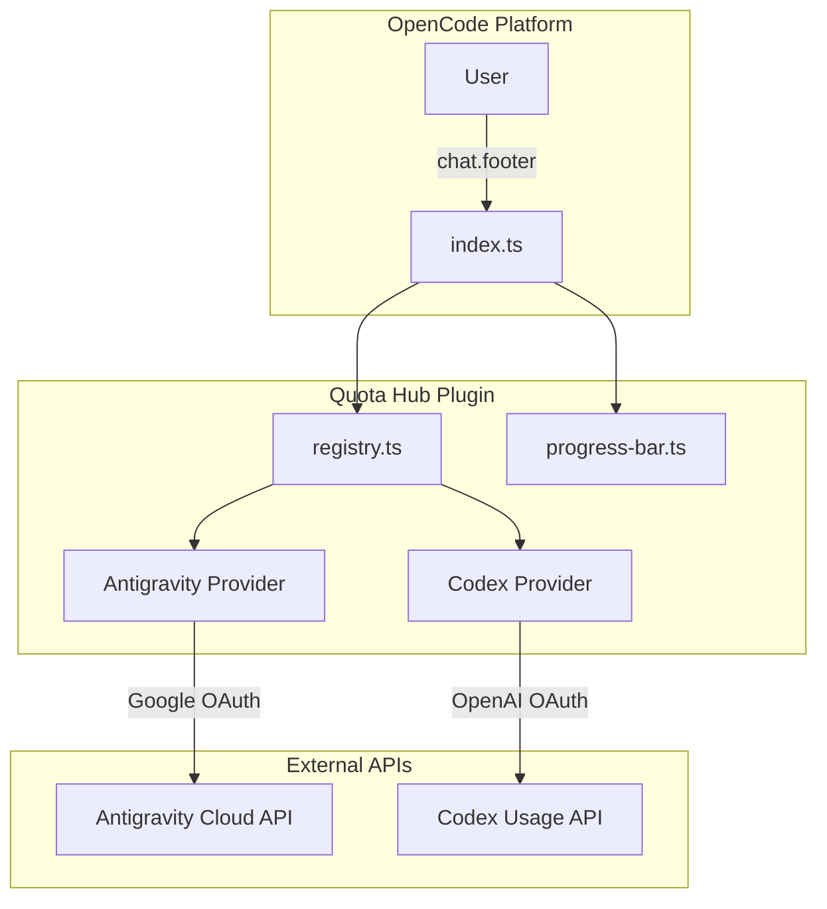

# Design & Requirements: Opencode Quota Hub

This document outlines the requirements and architectural design for the `opencode-quotas` plugin.

## 1. Requirements

### Functional Requirements

- **Aggregate Quotas**: Retrieve quota data from multiple independent providers (Antigravity, Codex, etc.).
- **Message Footer Display**: Automatically render quotas in the chat footer after each final assistant response for passive monitoring (optional/configurable).
- **On-Demand Command**: Provide a `/quotas` command to display detailed quota information in a message bubble.
- **Visual Representation**: Display percentage-based quotas using ASCII progress bars with ANSI color gradients.
- **Dynamic Grouping**: Allow user-defined grouping of granular metrics (e.g., grouping various Google models into "Flash" or "Pro" tiers).
- **Consolidated Views**: Automatically pick the most restrictive metric when multiple windows exist (e.g., Codex Primary/Secondary windows).

### Non-Functional Requirements

- **Resilience**: The failure of one provider (API downtime/auth) must not crash the dashboard.
- **Extensibility**: Registry Pattern for easy addition of new providers.
- **Performance**: Parallel fetching using `Promise.all`.
- **Local Execution**: Handle commands locally via the "Local Provider" pattern to avoid unnecessary LLM costs and latency.
- **Zero Configuration**: Use existing system credentials (e.g., `~/.config/opencode/antigravity-accounts.json`).

---

## 2. Architecture & Design

### Component Diagram

The system follows a Registry pattern.



### Future Architecture: The "Local Provider" Pattern

*Note: This feature is planned but not currently implemented, pending platform support for custom plugin commands.*

To intercept a `/quotas` command without core changes, the plugin will implement a local version of the Vercel AI SDK `LanguageModel` interface.

1.  **Command Registration**: The plugin will inject the `/quotas` command into the OpenCode config via the `config` hook.
2.  **Provider Registration**: The plugin will register a custom provider `opencodeQuotas` pointing to a local implementation file using the `file://` protocol.
    ```typescript
    config.provider['opencodeQuotas'] = {
        name: "OpenCode Quotas",
        api: {
            npm: `file://${ctx.directory}/dist/src/local-provider.js`
        },
        models: {
            "execute": {
                name: "Quota Executor",
                id: "execute"
            }
        }
    };
    ```
3.  **Forced Routing**: The command definition will set the `model` to `opencodeQuotas:execute`.
4.  **Local Execution**: A `LocalQuotaModel` (implementing `LanguageModelV1`) will handle the request entirely within the plugin sandbox, returning the ASCII progress bars as text.
5.  **Snap-back**: Since the model override is per-request, the next user message automatically reverts to their previously selected LLM.

### Data Model

The `QuotaData` interface serves as the Common Data Model:

```typescript
interface QuotaData {
  providerName: string; // e.g., "Antigravity Pro"
  used: number; // Current consumption
  limit: number | null; // Total allowed (null for unlimited)
  unit: string; // e.g., "%", "credits"
  details?: string; // e.g., "resets in 2h"
}
```

### Quota Identity & Filtering

Each quota entry is assigned a unique `id` (e.g., `codex-primary`, `ag-flash`). This allows for:

- **Disabling Quotas**: Users can provide a `disabled` list of IDs in their configuration to hide specific progress bars.
- **Stable References**: IDs provide a predictable way to target specific metrics for grouping or styling.
- **Optional Footer**: The automated rendering of quotas in the chat footer can be toggled via the `footer` boolean in the configuration.

---

## 3. Implementation Details

### Grouping & Aggregation

The system treats all quotas as separate entities that can be aggregated:

- **Antigravity**: Models are aggregated into groups (e.g., "Flash") based on pattern matching. The group name becomes the base for the entity ID.
- **Filtering**: A central filtering layer in the plugin entry point ensures that any quota marked as `disabled` in the config is never rendered.

### Multi-Quota Support

The system is designed to support multiple quota bars for a single provider or model. For example:

- **Codex**: Displays separate bars for Primary and Secondary rate limit windows, along with credit balances if available.
- **Antigravity**: Groups models into categories (Flash, Pro, Premium) and displays the most restrictive quota for each category, resulting in multiple progress bars.

### UI Consistency

The `progress-bar.ts` utility handles ANSI color transitions:

- **Green**: < 50% used
- **Yellow**: 50% - 80% used
- **Red**: > 80% used

---

_Last Updated: 2026-01-11_
