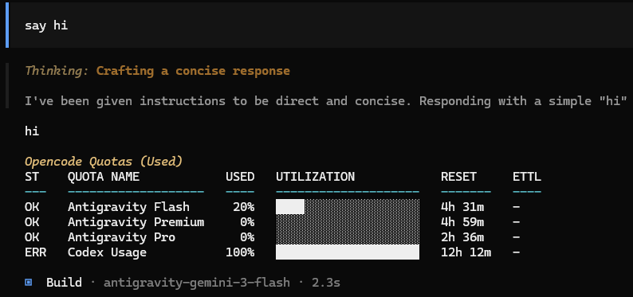

# OpenCode Quotas Plugin

**The ultimate usage dashboard plugin for your AI coding assistants.**

**OpenCode Quotas** is an OpenCode.ai plugin that aggregates usage data from Antigravity, Codex, and GitHub Copilot into a single, beautiful dashboard injected directly into your OpenCode chat footer. Never hit a rate limit unexpectedly again.



> **Note**: This is a community-developed plugin and is not officially affiliated with OpenCode.ai.

## Features

- **Unified Dashboard**: See all your AI quotas (Antigravity, Codex, Copilot) in one place.
- **Smart Predictions**: Uses linear regression on usage history to predict when you'll exhaust your quota.
- **Visual Progress Bars**: ANSI-colored bars that change from green to yellow to red as you approach limits.
- **Context Aware**: Optionally filter quotas to show only those relevant to the active model.
- **Resilient**: Provider failures are isolated and won't break your chat experience.

## Installation

### 1. Clone & Build
Clone the repository into your OpenCode plugins directory and build it:

```bash
# Clone into your plugins directory
git clone https://github.com/your-org/opencode-quotas ~/.opencode/plugins/opencode-quotas

# Build the plugin
cd ~/.opencode/plugins/opencode-quotas
bun install
npm run build
```

### 2. Register the Plugin
Add `opencode-quotas` to your OpenCode configuration file (typically `~/.opencode/config.json`) under the `plugins` array:

```json
{
  "plugin": [
    "opencode-antigravity-auth",
    "opencode-quotas"
  ]
}
```

## Usage

Once installed and registered, a live quota summary is automatically appended to the final assistant response footer in OpenCode. The plugin waits for the session to go idle before injecting to avoid duplicate footers during multi-step runs.

### CLI Mode (Optional)

You can also use OpenCode Quotas as a standalone CLI tool to check quotas directly from your terminal:

```bash
# Show all quotas
opencode-quotas

# Filter by model (simulates what the plugin does automatically)
opencode-quotas --provider google --model antigravity-gemini-3-flash
```

> **Tip**: During development, use `bun run opencode-quotas` to run without building.

## Supported Providers

| Provider | Raw Quota IDs | Aggregated IDs | Description |
| :--- | :--- | :--- | :--- |
| **Antigravity** | `ag-raw-*` | `ag-flash`, `ag-pro`, `ag-premium` | Raw model quotas aggregated by pattern into Flash, Pro, and Premium tiers. |
| **Codex** | `codex-primary`, `codex-secondary` | `codex-smart` | Rate limits aggregated using most-critical strategy. |
| **GitHub Copilot** | — | — | ⚠️ Experimental (requires `enableExperimentalGithub: true` in config, disabled by default) |

> **Note**: Quota IDs are used in configuration options like `disabled`.

## Column Reference

| Column | Description |
| :--- | :--- |
| `status` | Health indicator: `OK` (normal), `WRN` (warning), `ERR` (at/over limit) |
| `name` | Display name of the quota (e.g., "Antigravity Flash") |
| `bar` | Visual progress bar showing utilization |
| `percent` | Numeric percentage of quota used |
| `reset` | Time until the quota resets (e.g., "23m", "1h 30m") |
| `ettl` | **E**stimated **T**ime **T**o **L**imit - predicted time until quota exhaustion based on usage trends |
| `value` | Raw used/limit values (e.g., "150/500 credits") |
| `window` | Rate limit window duration (e.g., "5h window") |
| `info` | Additional info or alerts (e.g., "unlimited", "!!") |

## Configuration

All configuration is done via `.opencode/quotas.json` in your project root. Settings apply to both the CLI and plugin.

### Model Filtering

By default, `filterByCurrentModel` is disabled (false). Enable it to show only quotas relevant to the active model.

```json
{
  "filterByCurrentModel": false
}
```

**How it works**: The plugin extracts tokens from the model ID (e.g., `antigravity-gemini-3-flash` becomes `["antigravity", "gemini", "3", "flash"]`) and scores each quota by how many tokens match its ID or name. The highest-scoring quotas are displayed.

**Before filtering (all quotas):**
```text
ST    QUOTA NAME            USED   UTILIZATION            RESET    ETTL
---   -------------------   ----   --------------------   ------   -----
OK    Antigravity Flash      20%   ████░░░░░░░░░░░░░░░░   28m      13m
OK    Antigravity Premium    40%   ████████░░░░░░░░░░░░   56m      1h 0m
ERR   Codex Usage           100%   ████████████████████   13h 9m   -
```

**After filtering (model: `google/antigravity-gemini-3-flash`):**
```text
ST    QUOTA NAME          USED   UTILIZATION            RESET   ETTL
---   -----------------   ----   --------------------   -----   ----
OK    Antigravity Flash    20%   ████░░░░░░░░░░░░░░░░   28m     13m
```

### Hide Specific Quotas

Permanently hide quotas you don't care about:

```json
{
  "disabled": ["ag-pro", "codex-smart"]
}
```

### Smart Aggregation

Combine multiple quotas into a single display row using explicit sources or pattern matching.

**Pattern-based aggregation** (matches raw quota IDs/names):
```json
{
  "aggregatedGroups": [
    {
      "id": "ag-flash",
      "name": "Antigravity Flash",
      "patterns": ["flash"],
      "providerId": "antigravity",
      "strategy": "most_critical"
    }
  ]
}
```

**Explicit source aggregation** (specify exact quota IDs):
```json
{
  "aggregatedGroups": [
    {
      "id": "codex-unified",
      "name": "Codex Usage",
      "sources": ["codex-primary", "codex-secondary"],
      "strategy": "most_critical"
    }
  ]
}
```

**Aggregation options:**
| Option | Type | Description |
| :--- | :--- | :--- |
| `id` | string | Unique identifier for the aggregated quota |
| `name` | string | Display name |
| `sources` | string[] | Explicit quota IDs to include |
| `patterns` | string[] | Patterns to match against raw quota IDs/names |
| `providerId` | string | Limit pattern matching to a specific provider |
| `strategy` | string | Aggregation strategy (see below) |

**Aggregation strategies:**
| Strategy | Description |
| :--- | :--- |
| `most_critical` | Shows the quota predicted to hit its limit soonest (requires usage history) |
| `max` | Shows the quota with highest current usage percentage |
| `min` | Shows the quota with lowest current usage percentage |
| `mean` | Displays average usage across all sources |
| `median` | Displays median usage across all sources |

## Output Customization

All options below work in both CLI and plugin output. ANSI colors only render in terminal environments.

### Select Columns

```json
{
  "table": {
    "columns": ["name", "bar", "percent"]
  }
}
```

```text
QUOTA NAME            UTILIZATION            USED
-------------------   --------------------   ----
Antigravity Flash     ████░░░░░░░░░░░░░░░░    20%
Antigravity Premium   ████████░░░░░░░░░░░░    40%
Codex Usage           ████████████████████   100%
```

### Progress Bar Style

```json
{
  "progressBar": {
    "filledChar": "=",
    "emptyChar": "-",
    "width": 10
  }
}
```

```text
ST    QUOTA NAME            USED   UTILIZATION   RESET
---   -------------------   ----   -----------   ------
OK    Antigravity Flash      20%   ==--------    23m
OK    Antigravity Premium    40%   ====------    51m
ERR   Codex Usage           100%   ==========    13h 4m
```

### Show Remaining Capacity

Switch from "used" (default) to "available" mode. This inverts the display—useful if you prefer seeing how much is left:

```json
{
  "progressBar": {
    "show": "available"
  }
}
```

```text
ST    QUOTA NAME            USED   UTILIZATION            RESET
---   -------------------   ----   --------------------   ------
WRN   Antigravity Flash      80%   ████████████████░░░░   23m
OK    Codex Usage             0%   ░░░░░░░░░░░░░░░░░░░░   13h 4m
```

> **Note**: In "available" mode, the percentage shows remaining capacity, and status thresholds are inverted.

### Hide Table Header

```json
{
  "table": {
    "header": false
  }
}
```

```text
OK    Antigravity Flash      20%   ████░░░░░░░░░░░░░░░░   23m      5h 52m
OK    Antigravity Premium    40%   ████████░░░░░░░░░░░░   51m      1h 2m
ERR   Codex Usage           100%   ████████████████████   13h 4m   -
```

### Disable Colors

For plain text output (logging, CI, or non-TTY environments):

```json
{
  "progressBar": {
    "color": false
  }
}
```

### Custom Color Thresholds

Define when colors change based on usage percentage:

```json
{
  "progressBar": {
    "color": true,
    "gradients": [
      { "threshold": 0.5, "color": "green" },
      { "threshold": 0.8, "color": "yellow" },
      { "threshold": 1.0, "color": "red" }
    ]
  }
}
```

Available colors: `red`, `green`, `yellow`, `blue`, `magenta`, `cyan`, `white`, `gray`

## Full Configuration Reference

See [schemas/quotas.schema.json](schemas/quotas.schema.json) for the complete JSON Schema.

| Option | Type | Default | Description |
| :--- | :--- | :--- | :--- |
| `footer` | boolean | `true` | Show quotas in chat footer |
| `filterByCurrentModel` | boolean | `false` | Filter quotas by active model |
| `disabled` | string[] | `[]` | Quota IDs to hide |
| `progressBar.color` | boolean | `false` | Enable ANSI colors |
| `progressBar.width` | number | `20` | Progress bar character width |
| `progressBar.show` | string | `"used"` | `"used"` or `"available"` |
| `table.columns` | string[] | (auto) | Columns to display |
| `table.header` | boolean | `true` | Show column headers |
| `aggregatedGroups` | array | (see defaults) | Quota aggregation with patterns or sources |
| `historyMaxAgeHours` | number | `24` | Max history age in hours |
| `pollingInterval` | number | `60000` | Refresh interval in ms |
| `predictionWindowMinutes` | number | `60` | Time window for regression analysis (minutes) |
| `predictionShortWindowMinutes` | number | `5` | Short time window for spikes (minutes) |
| `debug` | boolean | `false` | Enable debug logging |

## Security

Your credentials remain safe. This plugin uses standard local OAuth flows and stores tokens securely on your machine (`~/.config/opencode/`). No data is sent to third-party servers other than the quota providers themselves.

## Development

Built with **Bun** for speed.

```bash
bun install        # Install dependencies
bun test           # Run tests
npm run build      # Build for production
bun run opencode-quotas  # Run CLI in dev mode
```

## License

MIT
